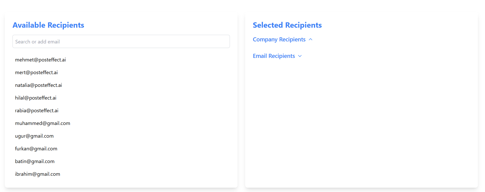
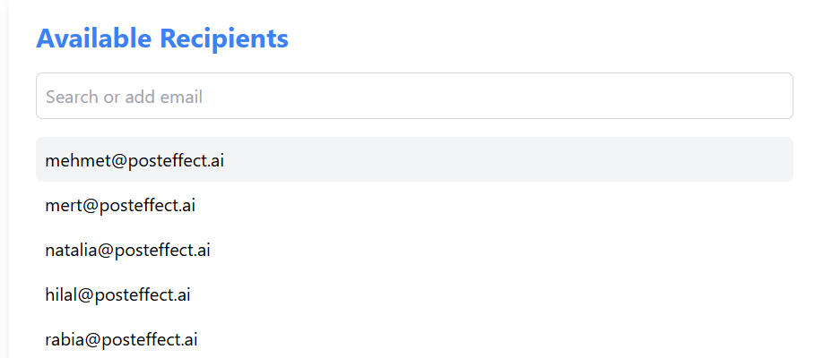
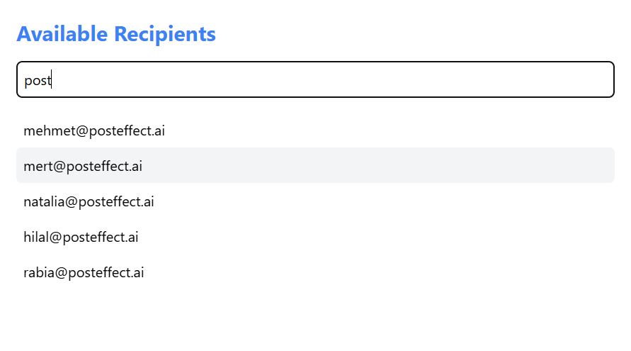
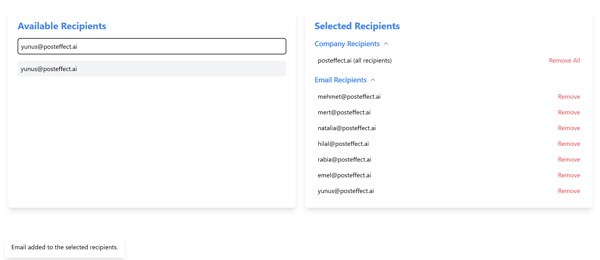
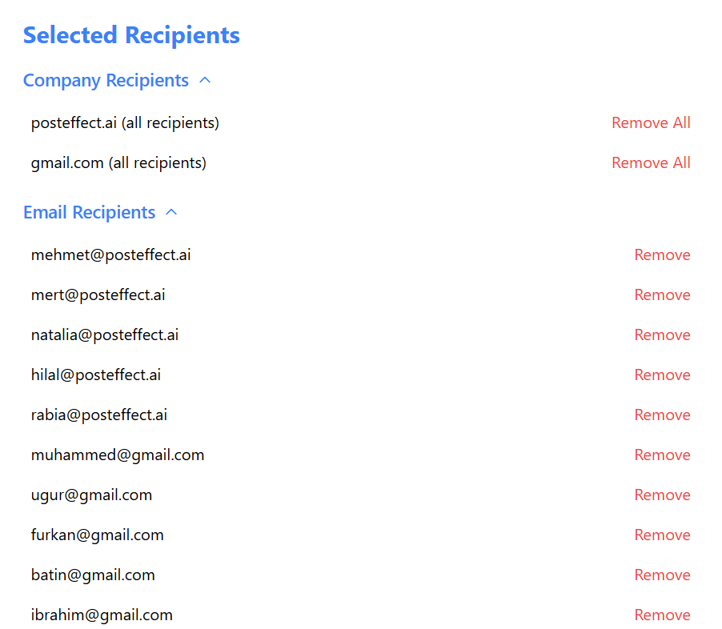
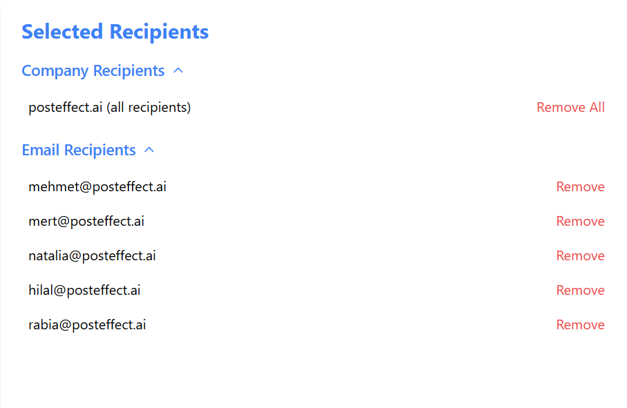
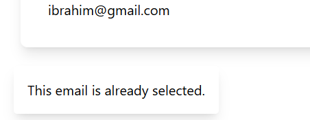

<h1>Email Manager Component</h1>

## Features

<ul>
  <li>Display a list of available recipients.</li>
  <li>Add or remove individual email addresses or entire domains.</li>
  <li>Filter emails by domain (e.g., @posteffect.ai).</li>
  <li>Auto-complete functionality to search for company domains and add valid email addresses.</li>
  <li>Expandable sections to show individual recipients grouped by domain and non-domain emails.</li>
  <li>Remove individual emails or all emails associated with a domain.</li>
</ul>

**Technologies Used:**

- **React**: JavaScript library for building user interfaces.
- **TypeScript**: Strongly typed JavaScript for better code quality.
- **Material-UI**: UI library for easily integrating modern components.
- **Tailwind CSS**: Utility-first CSS framework for rapid UI development.

## Screenshot

**General look of the component**

**Adding users by clicking on the email**

**Auto-complete**

**Adding a new email**

**Selected Recipients**

**When a company domain is selected, all emails with the domain are added to the selected recipients’ list**

**When adding an already selected email it gives a notification also when adding a new email the component gives a natification**

## Used References

- [React Documentation](https://react.dev/)
- [Material-UI Documentation](https://mui.com/)
- [Tailwind CSS Documentation](https://tailwindcss.com/docs/installation)
- [TypeScript Documentation](https://www.typescriptlang.org/docs/)
- [ChatGPT](https://chatgpt.com/)
